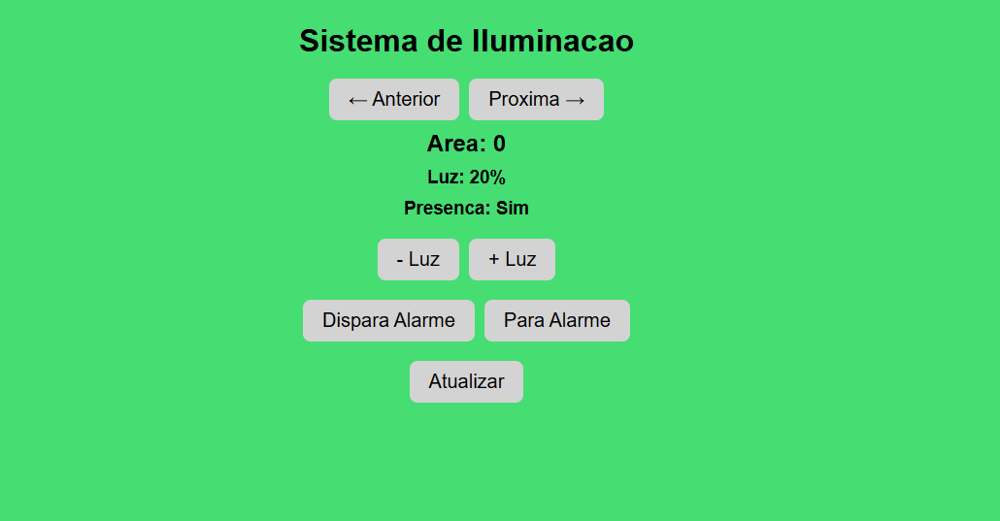

# 📡 Sistema de Iluminação Inteligente com Raspberry Pi Pico W

Projeto embarcado com **Raspberry Pi Pico W** para controle inteligente de iluminação com:

- Display **OLED SSD1306**
- Interface **WebServer**
- Controle de **10 áreas de iluminação**
- **Alarme sonoro**
- **Matriz de LEDs WS2812**
- Detecção de **presença via joystick**
- Modo de **economia de energia automática**

---

## ✨ Funcionalidades

- ✅ Controle individual de 10 áreas
- 📊 Exibição em display OLED
- 📶 Controle remoto via WebServer embutido
- 🚨 Alarme sonoro ativável por web
- 🌈 Iluminação via LEDs WS2812
- 🕹️ Joystick como entrada de presença
- ⚡️ Modo de economia: desliga LEDs após 2s de inatividade

---

## 🛠️ Componentes

| Componente             | Descrição                         |
|------------------------|-----------------------------------|
| Raspberry Pi Pico W    | MCU principal com Wi-Fi           |
| OLED SSD1306 (I2C)     | Display para informações          |
| Matriz de LEDs WS2812  | Iluminação RGB                    |
| Joystick analógico     | Entrada de presença               |
| Buzzer                 | Alarme sonoro                     |
| LED vermelho           | Indica modo economia              |

---

## 🌐 WebServer

Ao conectar o Pico W à sua rede Wi-Fi, o endereço IP será exibido na serial. A interface Web permite:

- 🔁 Navegar entre áreas (Anterior / Próxima)
- 🔆 Alterar intensidade da luz (Mais / Menos)
- 🚨 Ativar ou desativar alarme
- 👁️ Visualizar estado da presença e intensidade

> ⚠️ **Atenção:** As informações como presença e estado são atualizadas somente com novo acesso ou refresh da página.

---

## 📶 Configuração Wi-Fi

No `main.c`, defina suas credenciais:

```c
#define WIFI_SSID "USER"
#define WIFI_PASSWORD "SENHA"
Altere para sua rede local antes de compilar.

⚙️ Compilação
Instale e configure o Pico SDK.

📸 Interface Web


🧠 Lógica de Presença
A presença é detectada se o valor do eixo Y do joystick ultrapassar determinado limite. Se não houver atividade por 2 segundos:

💡 LED da área atual é desligado

🔴 LED vermelho se acende (modo economia)

---

📃 Autor
Leonam S. Rabelo